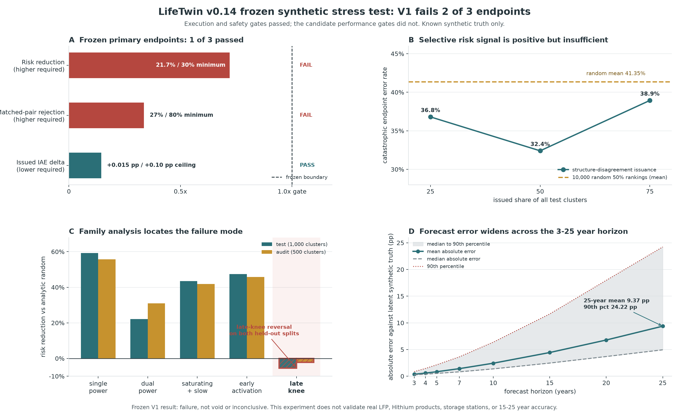
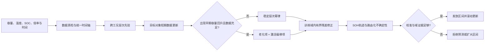

# LifeTwin

[](https://github.com/packl686-arch/LifeTwin-LFP-SOH/actions/workflows/ci.yml)

## 2026 参赛当前版本

LifeTwin 是面向储能 LFP 电池的证据优先型 SOH 轨迹预测与动态修正原型。当前参赛版本已经把公开数据研究、私有数据盲测接口、飞书 AI 工作流和评审证据入口整理为一条可复核链路：

- [V5 在线评审与飞书流程控制台](https://packl686-arch.github.io/LifeTwin-LFP-SOH/v5-console/)
- [完整中文参赛方案](docs/LifeTwin_competition_submission_cn.md)
- [V5 模型与不确定性报告](reports/fastcharge_v5_pairwise_development_2026-08-09.md)
- [动态 landmark 与在线残差审计](reports/fastcharge_v5_dynamic_landmark_audit_2026-08-09.md)
- [V5 小型机器可读证据包](showcase/evidence_v5/README.md)
- [V6 有界状态更新与选择性门控报告](reports/fastcharge_v6_bounded_state_development_2026-08-10.md)
- [V6 训练内 challenger 证据包](showcase/evidence_v6/README.md)
- [V7 重发感知创新状态报告](reports/fastcharge_v7_reissue_innovation_development_2026-08-10.md)
- [V7 训练内嵌套与批次压力证据](showcase/evidence_v7/README.md)
- [V7 冻结门控前缀稳健性审计](reports/fastcharge_v7_prefix_robustness_audit_2026-08-10.md)
- [V7 稳健性负结果证据](showcase/evidence_v7_robustness/README.md)
- [V8 测量稳定性盲测协议模板](configs/experiments/v8_measurement_stability_blind_protocol.template.json)
- [V8 真实执行配置模板](configs/experiments/v8_measurement_stability_execution.template.json)
- [V8 执行手册与数据字典](docs/v8_measurement_stability_execution_cn.md)
- [V8 合成软件演练证据](showcase/evidence_v8_dry_run/README.md)
- [V9 端到端相关扰动盲测协议](configs/experiments/v9_end_to_end_correlated_stability_blind_protocol.template.json)
- [V9 实验设计与执行说明](docs/v9_end_to_end_correlated_stability_experiment_cn.md)
- [V9 合成端到端重拟合证据](showcase/evidence_v9_dry_run/README.md)
- [海辰私有数据盲测执行手册](docs/hithium_private_blind_execution_cn.md)
- [飞书 AI 工作流设计](docs/feishu_ai_workflow_cn.md)

在 MATR FastCharge 公开 LFP 队列的回顾性开发中，V5 只用 41 个训练电芯完成物理电芯级模型选择，在 81 个公开评估电芯上的 cycle-300 轨迹 MAE 为 **0.2082 pp**，相对 V2 稳定硬门控降低 **27.3%**。支持门控后的 90% 共形区间覆盖率为 **93.10%**，平均宽度为 **1.4155 pp**。

动态 landmark 审计进一步发现：较长前缀重签发的 transition-equal MAE 从 0.2644 pp 降至 **0.1738 pp**，但收益并非每个时点都稳定；三种冻结 GP 候选均未达到 70% 电芯改善门槛，因此系统保留 V5 中心并关闭额外 GP 修正。这项负结果体现了项目的核心原则：**模型只能凭新证据晋级，不能凭复杂度或叙事晋级。**

后续 V6 训练内实验进一步验证了“全量残差更新”仍不够稳定；V6.1 因而改成选择性门控。嵌套留一电芯审计中，P100 门控触发 `10/41` 个电芯并改善其中 `8/10`，全体 P100 MAE 从 `0.24360 pp` 降至 `0.22397 pp`。由于门控由同一批 41 个训练电芯启发，它只被冻结为下一批 outcome-blind 候选，**没有启用、没有再次查看 81 个已暴露评估电芯，当前 champion 仍是 V5**。

V7 进一步扣除当前 V5 重发轨迹已经吸收的趋势，只投影“未吸收创新量”。P100 外层留一电芯审计激活 `9/41` 个电芯并实现 `9/9` 改善，全体 P100 MAE 从 `0.24360 pp` 降至 `0.20628 pp`；两个 MATR 批次双向留出也均通过。P40 虽通过逐电芯门槛，却因批次迁移失败而被淘汰。

但冻结后的前缀扰动审计否决了 V7-P100 的当前盲测资格：在 `0.02 pp` IID 噪声下，门控决策一致率只有 `84.20%`，原未激活电芯误触发率为 `14.55%`；在 `0.05 pp` 下激活精度降至 `58.58%`，重复内最差 active delta 的 P95 为 `+0.1414 pp`。因此项目没有用训练内 `9/9` 结果继续包装升级，而是撤回该候选，要求后续先提供重复测量或独立设备噪声台账。**V5 继续作为当前 champion，V7 从未启用。**

V8 已把这条负结果转化为可执行实验：先用重复测量、日参考和跨设备桥接记录建立不读取未来结局的噪声台账，再以 1024 次测量重采样检查每个 P100 更新是否稳定；任何质量、映射或概率门槛失败均逐元素精确回退 V5。合成演练仅证明代码与哈希承诺链可运行，**没有产生新的准确率证据**。真实 Stage C 仍需至少 60 个新电芯、3 个制造批次和完整队列预测承诺后才能一次性开放未来轨迹。

V9 进一步把扰动向上游推进：每次 draw 都重新扰动历史参考测量与目标前缀、重建 V5 训练矩阵、重拟合冻结模型、重选 12 个近邻，再重新生成 P60/P100 中心并执行未经修改的 V7 门控；误差模型显式包含共同偏置、AR(1)、漂移和尖峰。24-draw 合成演练实际完成了 48 次 V5 重拟合，稳定路径的最终签发轨迹偏差 P95 为 `0.01261 pp`，人工压力负对照则精确回退 0 修正。该结果仍只是软件证据，**不代表真实测量稳定性或模型准确率提升，V5 仍是 champion**。

> 边界：仓库不包含海辰内部测量，也不公开 MATR、SNL 等上游原始数据。上述数字属于结果已暴露的公开循环老化开发证据，不是海辰产品验证、日历老化确认或 15 至 25 年准确率证明。

以下 V0.14 及更早章节保留了项目此前的预注册压力测试、日历老化研究和对抗审计历史，便于评委查看完整研发轨迹。

面向储能 LFP 电池的证据优先型 SOH 寿命数字孪生。

LifeTwin 不试图用一条短曲线直接“猜出 25 年寿命”，而是先从跨温度、
跨 SOC 的公开老化数据中学习共性规律，再用目标对象已经产生的短期数据
持续修正长期轨迹，并在证据不足时明确扩大区间或回退稳定模型。

> 本仓库是独立竞赛研究原型，不是海辰官方产品，不含海辰内部数据，当前
> 结果也不构成海辰电芯或储能电站的产品精度承诺。

## 评委快速入口

先用三分钟看到系统如何工作，再按需深入证据：

1. [评委三分钟简报](JUDGE_BRIEF.md)：一屏了解问题、方法、四个关键结果和边界。
2. [在线评审控制台](https://packl686-arch.github.io/LifeTwin-LFP-SOH/judge-console/)：零安装交互查看通用回退、专用路由和外部负迁移三个冻结案例；[离线单文件](docs/judge-console/index.html)也随仓库冻结。
3. [真实前缀预测入口](showcase/product_demo/README.md)：用不含未来容量的请求生成预测、区间状态、拒绝原因和哈希。

前缀 CLI 面向源码或 editable checkout；当前版本不把冻结参考数据拆离 Git 仓库包装成
standalone wheel 推理服务。

深入证据：[V0.14 预注册长时域压力测试报告](reports/synthetic_long_horizon_identifiability_result_v1_2026-07-22.md) ·
[V0.16 / V2.1 正式终态与根因收口](reports/synthetic_long_horizon_identifiability_v2_1_formal_closeout_20260809.md) ·
[V0.14 机器可读证据](showcase/evidence_v014/README.md) ·
[V0.13 可操作入口报告](reports/product_entry_v013_2026-07-22.md) ·
[开题报告补充材料](SUBMISSION_SUPPLEMENT.md) ·
[V0.12 稳健性报告](reports/robustness_and_long_term_protocol_2026-07-21.md) ·
[独立长期验证预注册](docs/independent_long_term_lfp_preregistration.md) ·
[Phase 1 对抗性审计](reports/phase1_adversarial_audit_2026-07-20.md) ·
[参考资料](docs/references.md)

## V0.14 预注册长时域压力测试

我们在查看合成长时域真值前冻结代码、种子、三个主终点和失败规则，再对
2,900 条 25 年轨迹执行一次性测试。运行和四项安全门均完整通过，但预注册的
方法判定为 **failure**，没有因为结果不理想而改门槛或重写结论。

| 预注册终点 | 实际结果 | 冻结门槛 | 判定 |
|---|---:|---:|---|
| 50% 签发率下的灾难性误差风险降低 | 21.65% | 至少 30% | 未通过 |
| 共享完全相同短期前缀的反例对，两侧同时拒绝 | 27.0% | 至少 80% | 未通过 |
| 已签发轨迹相对平方根基线的平均 IAE 增量 | +0.0146 pp | 不高于 +0.10 pp | 通过 |

该结果给出两个有用边界：结构分歧具有风险排序信号，但当前最大包络门控被固定的
晚期 knee 先验宽度主导；而完全相同前缀可以对应明显不同的 25 年结局，单靠前缀
不可能辨认哪一侧会发生晚期拐点。下一版不能只调阈值，而应把中心预测、可校准风险头
和部分可识别区间分开，并在新种子、新真值族和可观测工况协变量上重新预注册验证。



## 核心方法



三个核心设计是：

- **跨工况到目标对象的动态更新**：用温度和 SOC 条件学习群体先验，再用目标
  对象少量观测同步修正退化幅度和时间指数。面向“目标电芯/单电芯”更新是产品
  架构目标；当前公开实验没有单电芯轨迹，实际更新的是 target condition-mean
  trajectory（目标条件均值轨迹）。
- **早期激活与不可逆老化分离**：针对低 SOC 下容量先升后降的形状，增加
  饱和激活偏移项，避免单调模型把早期回升误判成长期快速衰减。
- **证据驱动的模型门控**：只有异常形状和观测数量同时满足条件才启用专用
  模型，否则回退稳定主模型，避免复杂模型在普通工况中过拟合。
- **受约束的残差学习**：残差只从训练条件的交叉拟合误差中学习，在 landmark
  处锚定为零，并受时间支持和幅度上限约束，不允许黑盒修正吞掉机理主模型。
- **路由化校准与拒绝发行**：specialist 和 fallback 分开按条件轨迹校准；样本量、
  工况域、前缀轨迹支持或长期独立证据不足时，不输出貌似精确的运营区间。

## 回顾性开发结果

下表是公开 Naumann 日历老化数据上的回顾性开发结果。`p=10` 表示每条目标
轨迹只用前 10 次容量检查建模，再预测后续轨迹；误差指标为平均轨迹绝对误差
（IAE，越低越好）。

| 场景 | 传统平方根曲线 | 层次幂律 V2 | 门控激活 V3 | V2 相对传统方法 | V3 相对 V2 |
|---|---:|---:|---:|---:|---:|
| 未见温度层级 | 1.1287 pp | 0.4801 pp | 0.3662 pp | -57.46% | -23.72% |
| 40 C SOC 插值 | 1.2864 pp | 0.6907 pp | 0.2097 pp | -46.31% | -69.64% |

必须同时看到限制：V3 在主前缀只触发 3 个唯一低 SOC 条件，大量条件与 V2
完全相同，因此描述性 bootstrap 区间上界为 0，而不是小于 0；严格优越标准
没有通过。`tau=3-14 day` 的核心敏感性网格保持平均改善；`tau=20 day` 时只有
未见温度场景反转，`tau=30 day` 时两个场景都反转。主值 7 天又是在查看前一阶段
失效后确定的 post-hoc 值。结论只能称为有潜力的机制开发信号，不能称为独立验证。


## Phase 1 对抗性审计

审计不是再做一遍同样的实验，而是主动攻击证据链：核对数据身份和单位，在
`p=5/8/10/14` 分别修改未来容量标签，独立复算 504 个条件-方法指标组，检查
六种方法的共同支持与 6 组消融，并对门控边界和专用模型失败进行故障注入。

审计还发现了一个真实评分完整性问题：仅检查预测包哈希，无法阻止攻击者篡改
`elapsed_days` 或 `is_final_checkup` 后重新计算哈希。V2/V3 评分器现改为连接权威
真值坐标、用真实时间轴积分并由真值派生末点；重新哈希的坐标和 final 攻击会被拒绝。

`p=10` 的 21 个场景-条件行中，主候选相对 V2 为 4 行改善、17 行精确回退、
0 行相对退化。0 退化主要来自“门控未触发就复制 V2”的结构，不代表 21 个条件都
验证了 V3；4 个改善行只有 3 个唯一条件。`T40_SOC12.5` 在两个场景中重复出现，
不能重复计作两份证据。在 `p=10` 的 21 个 scenario-condition occurrences 中，以
所有正向 IAE gains（`V2 IAE - V3 IAE > 0`）之和为分母，该条件贡献约 90.35%。

跨全部四个 landmark 的 84 行合计为 **72 exact fallback、9 improvement、3 relative
regressions**。三处相对退化（`V3 IAE - V2 IAE`）分别是：`p=8, T25_SOC0`
`+0.52968452368701047 pp`；`p=8, T40_SOC0` `+0.19573480305547392 pp`；
`p=14, T40_SOC0` `+0.048279793130974941 pp`。因此不能把 `p=10` 的零相对退化外推到
其他观测长度。

完整解释见 [Phase 1 对抗性审计报告](reports/phase1_adversarial_audit_2026-07-20.md)。
机器可读入口包括
[审计总览](showcase/audit_results/phase1_adversarial_audit.json)、
[未来标签攻击矩阵](showcase/audit_results/future_label_attack_cases.csv)、
[独立指标复算](showcase/audit_results/independent_metric_audit.csv)、
[消融表](showcase/audit_results/ablation_audit.csv)、
[门控边界](showcase/audit_results/gate_boundary_cases.csv)和
[84 行失败条件表](showcase/audit_results/failure_condition_table.csv)。

**审计通过不等于模型验证通过。** 数据仍只有 17 条条件均值轨迹，条件级评估单位
`N=17`，最长约 885 天；这不是单电芯级验证，不能支持海辰产品、真实电站或
15-25 年预测精度宣称。

## V0.11：landmark、区间和外部负结果

本轮先完成正确性审计，再扩展方法。所有前缀被放到检查点 14-34 的相同未来窗口
比较后，只有 `p=10` 同时满足两场景均值改善、逐条件零退化和唯一改善条件要求。
它被记为**回顾性信号 landmark**，而不是预注册确认点；确认值仍为 `null`。

V4 将层次机理均值、训练条件 LOCO 有界残差和按路由校准的轨迹区间组合起来。
fallback 路由的 5 个校准条件只足以形成 80% 诊断分位数；specialist 仅 1 个校准
条件，80%/90%/95% 都拒绝。4 条测试轨迹中只有 3 条获得回顾性 80% 诊断区间，
运营区间发放数为 **0**，因为校准结果已被复用且没有独立长期数据。

项目还引入许可明确的 Geisbauer 独立电芯级 LFP 队列做 120 天、60 C 外部应力
筛查。15 个电芯全部因前缀不足而回退稳定模型；主候选平均 IAE 为 `3.9735 pp`，
目标前缀平方根比较器为 `3.8852 pp`，主候选**没有胜出**。项目保留这个负结果，
不重调协议，也不把短期高温筛查改称长期验证。详见
[完整报告](reports/landmark_v4_external_evidence_2026-07-20.md)和
[机器可读证据包](showcase/evidence_v011/README.md)。

## V0.12：先检验结论有多脆弱

V0.12 不晋升新均值模型，而是对 v0.11 的两个核心结果做反证优先审计。固定 V4
训练状态后，在 10 个非训练条件上枚举全部 `C(10,6)=210` 个校准/评估划分。
fallback 路线只有 80% 分位数可计算，乘数范围为 `0.9243-2.1698`；specialist
路线每个划分只有 0-2 条校准轨迹，因此 80%/90%/95% 全部不可用。原切分宽度又
主要由 `T40_SOC50` 一条高误差轨迹支配。这证明当前区间适合做拒绝诊断，不适合
包装成稳定覆盖保证。

Geisbauer 的逐电芯复核在 `1e-12 pp` 数值零阈值下得到 8 个候选更好、7 个更差；
采用事后 `0.05 pp` 等效界时为 5 个更好、4 个更差、6 个等效。平均配对差为
`+0.0882 pp`，中位数为 `-0.0022 pp`；15 个彼此重叠的单电芯删除场景中有 2 个
会使总体方向反转。负迁移风险主要位于 100% SOC，但样本不足以给出确认性推断。完整数字、
名义检验边界和 210 个重叠划分的正确分母见
[V0.12 报告](reports/robustness_and_long_term_protocol_2026-07-21.md)。


项目同时公开长期 LFP [数据集资格登记表](docs/long_term_lfp_dataset_registry.md)、
[数据无关预注册模板](configs/validation/independent_long_term_lfp_protocol.template.json)和
[跨字段语义验证器](src/lifetwin/validation/long_term_protocol.py)。
当前可立即用于独立长期轨迹确认的公开数据集数量仍为 **0**。这不是搜索失败后留下
一句“待补数据”，而是把许可、物理电芯 ID、老化模式、时长、结局接触史和证据等级
变成机器可读门槛；获得作者数据后也不能临时修改成功标准。

## 仓库结构

```text
LifeTwin-LFP-SOH/
├── src/lifetwin/              原型代码
├── configs/experiments/       冻结实验协议
├── configs/inference/         前缀推理请求 Schema
├── configs/validation/        长期数据资格与预注册 Schema/模板
├── data/interim/              CC BY 4.0 的规范化 Naumann 表
├── data/external/             CC BY 4.0 的 Geisbauer LFP 外部应力数据
├── scripts/                   实验、审计与一键复现入口
├── showcase/product_demo/     不含未来容量的真实推理请求
├── showcase/                  数据分析样本与公开审计产物
├── docs/judge-console/        自包含中文评审控制台
├── docs/                      补充材料、研究笔记与参考资料
├── reports/                   技术阶段报告与对抗性审计报告
├── tests/                     GitHub 公开版复现测试
└── release_manifest.json      发布文件哈希与证据边界
```

## 快速复现

规范复现使用 Python 3.12.x 和冻结依赖约束：

```powershell
py -3.12 -m venv .venv
.\.venv\Scripts\python.exe -m pip install -c requirements\reproduction.txt -e ".[dev,showcase]"
.\.venv\Scripts\python.exe -m pytest -q
.\.venv\Scripts\python.exe scripts\verify_v014_synthetic_evidence.py
.\.venv\Scripts\python.exe showcase\analyze_phase8_results.py --output artifacts\quick\phase8_results.png
.\.venv\Scripts\lifetwin.exe calendar-prefix-predict --request showcase\product_demo\naumann_t40_soc37_5_request.json --output-dir artifacts\prefix-demo
```

Linux/macOS：

```bash
python3.12 -m venv .venv
.venv/bin/python -m pip install -c requirements/reproduction.txt -e '.[dev,showcase]'
.venv/bin/python -m pytest -q
.venv/bin/python scripts/verify_v014_synthetic_evidence.py
.venv/bin/python showcase/analyze_phase8_results.py --output artifacts/quick/phase8_results.png
.venv/bin/lifetwin calendar-prefix-predict --request showcase/product_demo/naumann_t40_soc37_5_request.json --output-dir artifacts/prefix-demo
```

安装依赖后，推荐用一个命令完成发布预检、Phase 8、动态 landmark、V4 区间与
校准切分审计、Geisbauer 外部应力与逐电芯稳健性审计、Phase 1 审计、无界面绘图
和完整测试，并把证据原子化
写入新目录：

```powershell
.\.venv\Scripts\python.exe scripts\reproduce_public_release.py --mode full --output artifacts\reproduction
```

Linux/macOS：

```bash
.venv/bin/python scripts/reproduce_public_release.py --mode full --output artifacts/reproduction
```

该命令拒绝覆盖已有输出。GitHub Actions 的 Ubuntu/Windows fresh-clone 运行记录见
[public-release-ci](https://github.com/packl686-arch/LifeTwin-LFP-SOH/actions/workflows/ci.yml)，
以对应提交的实际状态为准。
清单所列的已发布证据文件必须逐字节匹配 SHA-256。Phase 8 核心表的跨平台数值重算按
`2e-4` 绝对容差核对；Phase 1 审计表按主键对齐并默认逐字段精确比较，仅对求解器派生的
误差指标使用 `5e-3 pp`、派生比例使用 `1e-4`，审计残差仍限制为 `1e-10`，且拒绝
NaN/Inf。身份、工况、前缀、计数、真值、门控状态和结论字段不使用宽松容差。
比较器还会重算独立指标残差、消融差值、失败表回退关系与风险标签，避免各列分别落在
容差内却彼此矛盾。
环境敏感的模型状态哈希不做跨操作系统相等宣称，但必须保持行间等价类结构，并在每次
未来标签攻击运行内部满足 baseline 与 attacked 哈希相等。

重新运行完整 Phase 8 开发实验（普通 CPU 约几十秒，输出目录不可覆盖）：

```powershell
$env:PYTHONPATH='src'
.\.venv\Scripts\python.exe scripts\run_calendar_v3_activation_development.py
```

## 数据与许可

仓库包含两份许可明确且可公开再分发的数据文件。Naumann 数据集由 Maik Naumann
发布于 Mendeley Data，DOI 为
[`10.17632/kxh42bfgtj.1`](https://doi.org/10.17632/kxh42bfgtj.1)，许可为
[CC BY 4.0](https://creativecommons.org/licenses/by/4.0/)。转换和统计单位说明见
[数据说明](data/interim/README.md)。

Geisbauer LFP 数据由 Christoph Geisbauer、Markus Woerle、Philip Keil 和 Andreas
Jossen 发布于 Zenodo，DOI 为
[`10.5281/zenodo.6685365`](https://doi.org/10.5281/zenodo.6685365)，许可同为
CC BY 4.0。仓库保留原始 2.7 KB LFP CSV，说明见
[外部数据说明](data/external/geisbauer_2022/README.md)。它只有 120 天、60 C，
只用于外部应力筛查。

Stanford Lam/Joule 长期数据和作者代码在本项目审计时未发现明确的数据/软件
许可，因此没有上传任何文件或代码副本，只在[参考资料](docs/references.md)中
保留公开链接与待澄清状态。Vachenauer 十年端点、Yagci 180 Ah 储能电芯、Sui
月度轨迹和 Aeppli Second-Life 数据也仅登记一手来源与资格，不上传请求型数据。

## 当前成熟度

- 研究逻辑与原型闭环：完成。
- 公开数据上的回顾性开发：完成。
- 数据身份、未来标签隔离、独立评分复算与预测包坐标完整性：完成。
- 门控边界、专用模型故障回退和 84 行失败条件清单：完成。
- 固定共同未来窗口的动态 landmark 回顾性诊断：完成；确认性 landmark 待独立数据。
- 机理层级模型、LOCO 有界残差、路由化区间与拒绝发行：完成回顾性实现。
- 15 个独立 LFP 电芯的 120 天、60 C 外部应力筛查：完成，主候选未胜出。
- V4 全部 210 个校准划分与 Geisbauer 逐电芯/LOCO 稳健性审计：完成，未形成确认性结论。
- 严格请求 Schema、真实前缀推理 API/CLI、域外/异常前缀失败关闭与零安装评审控制台：完成。
- 长期 LFP 数据集资格登记、数据无关 Schema 与预注册模板：完成；当前合格公开确认集为 0。
- 合成长时域结构可辨识性 V1：按冻结协议完整运行；安全门通过，但两个主效门槛未达标，
  预注册结论为 failure，不晋升为长期预测方法。
- 合成长时域 V2.1：唯一正式尝试在 prediction commitment 前因实现契约作用域不匹配而
  终止；没有生成预测，没有评分，不属于成功或已评分失败，历史终态不追溯改写。
- V2.2：仅有未预注册、未授权执行的候选设计；2026-08-16 前保持 No-Go，优先完成参赛
  方案、演示与答辩。
- Ubuntu/Windows fresh-clone CI：`v0.14.1` 发布链路均为 914 项测试通过、0 项跳过；
  工程复现通过不增加模型精度或独立验证证据。
- 独立长期 LFP 队列验证：待完成。
- 海辰大容量电芯与真实电站验证：待完成。
- 15-25 年产品精度承诺：当前不允许。

## 阶段工作日志

这不是“只保留最好结果”的展示日志，而是从 2026-07-19 起按证据链压缩出的公开里程碑；
完整数字、失败原因和边界以对应冻结报告与机器可读产物为准。

- **2026-07-19｜原型闭环**：建立跨温度/SOC 层次先验、目标前缀动态更新和基础复现入口，
  把“短期数据持续修正长期轨迹”落实为可运行原型。
- **2026-07-20｜对抗审计**：完成未来标签攻击、独立指标复算、模型消融、门控故障注入和
  84 行失败条件清单；修复仅靠预测包哈希无法保护评分坐标的完整性缺口。
- **2026-07-21｜不确定性与外部筛查**：完成路由化区间、210 个校准划分稳健性审计及
  Geisbauer 15 个独立 LFP 电芯的 120 天、60 C 筛查；主候选未胜出，负结果原样保留。
- **2026-07-22｜可操作入口与长期压力测试**：发布严格请求 Schema、真实前缀 API/CLI 和
  零安装评审控制台；V0.14 合成 25 年预注册测试判定为 `failure`，没有事后改门槛。
- **2026-07-23—26｜第二轮冻结研究**：V0.15 完成预注册、实现冻结与一次正式尝试，终态为
  `inconclusive_not_success`；随后冻结 V2.1 校准修订和实现，继续保持结果前规则。
- **2026-08-03—04｜跨数据路线与企业接入准备**：形成 NASA 小样本方法开发、FastCharge
  安全硬门控回顾性证据，以及独立数据 metadata-only 接入和候选冻结流程；这些结果不替代
  长期日历老化或海辰电芯验证。
- **2026-08-05—07｜工程与治理收口**：保留 Windows 失败和 GitHub 官方事故期间的记录，
  完成 Ubuntu/Windows 全量复现、Pages 发布、公开文件冻结清单及 `v0.14.1` 工程版本。
- **2026-08-08—09｜V2.1 正式终态**：唯一正式尝试在预测前终止；只打开中心开发真值，
  未形成 prediction commitment，score 为空。根因收口为 7,200 行合法分区子集误用了
  71,400 行全量包契约；不重跑、不续跑，V2.2 在赛事提交前保持 No-Go。

提交人：Jincheng Liu

公开工程版本：`0.14.1`（标签冻结于 2026-08-07）

研究状态更新：2026-08-10
