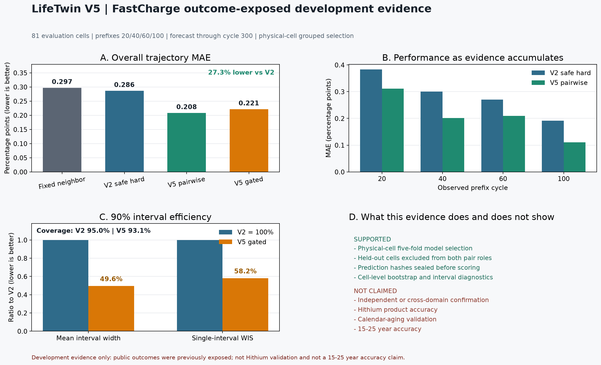
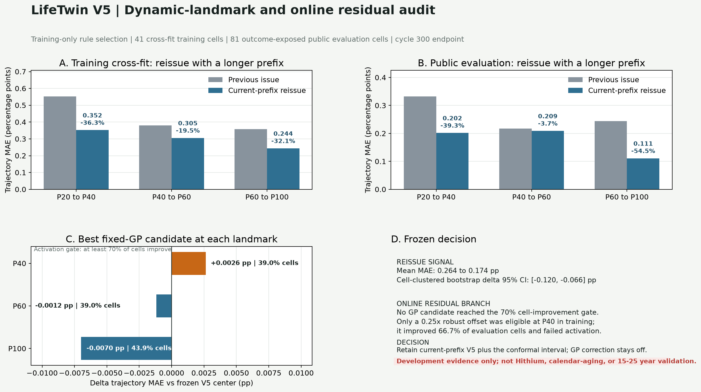
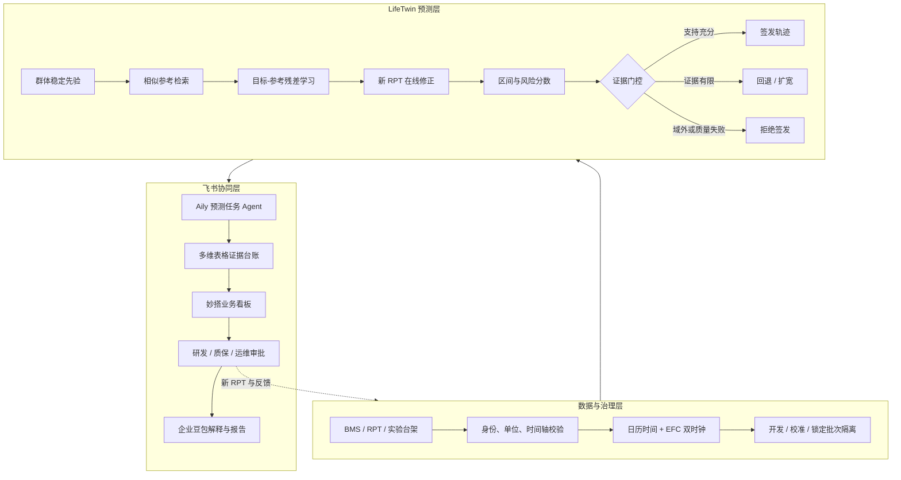
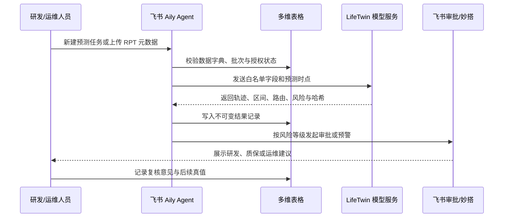

# LifeTwin 海辰储能命题参赛方案

> 建议将本文作为提交平台长文底稿。方括号内仅保留确实需要团队补充的信息；提交前删除所有提示文字。

## 一、参赛方案信息卡

| 项目 | 填写内容 |
|---|---|
| 队名 | **LifeTwin**（如报名系统已有正式队名，以正式队名替换） |
| 命题 | **海辰储能：基于短期数据的储能电池 SOH 长期预测与动态修正** |
| 一句话摘要 | **LifeTwin 不用一条曲线硬猜 25 年，而是从相似电芯学习退化参照，用目标电芯不断到来的短期数据滚动修正；证据不足时主动扩大区间、回退稳定模型或拒绝签发。** |
| 成员介绍与分工 | **刘锦城（Jincheng Liu）**：项目负责人，负责命题分析、数据治理、算法设计、实验协议、模型实现、审计测试及演示系统。若还有团队成员，请按“姓名 + 专长 + 可核验工作”逐项补充，不虚构履历。 |
| 使用的飞书 AI 能力 | **飞书 Aily + 多维表格 + 妙搭 + 企业豆包**。Aily 负责任务编排与证据判定，多维表格承担模型/预测/审批台账，妙搭提供业务看板，企业豆包把结构化结果转换成面向研发、质保和运维的解释。当前仓库已完成可调用预测核心和审计协议；飞书企业侧接入需在获得海辰租户权限后部署，不声称已进入海辰生产环境。 |

## 二、方案成果展示

### 1. 命题场景、问题与痛点

海辰储能面向全球交付百 GWh 级储能电芯及系统，而储能电站的设计寿命通常长达 15 至 25 年。现实矛盾是：电芯真实运行数据只积累了数年，产品研发、质保定价、运行维护和调度决策却必须提前判断十余年的健康风险。

传统做法常把有限的早期容量点拟合成一条经验曲线，再向远期延长。这在工况变化、批次迁移、早期容量回升或晚期拐点出现时容易产生三个问题：预测中心偏差大、区间虚假自信，以及新数据到来后无法稳定修正。

#### 五项核心痛点

| 痛点 | 技术表现 | 业务影响 |
|---|---|---|
| 数据时长远短于产品寿命 | 数年数据要支持十余年决策 | 质保、寿命设计和残值判断缺少可信依据 |
| 不同工况与批次退化路径不一致 | 单一曲线无法覆盖温度、SOC、倍率和策略差异 | 同一模型跨产品或跨站点迁移后可能失效 |
| 新数据持续到来 | 一次性报告无法随 RPT/BMS 数据更新 | 早期预测不能形成运营闭环 |
| 远期真值稀缺 | 模型可能在未见区域给出过窄区间 | 决策者无法区分“模型确信”和“模型没见过” |
| 算法与业务协作脱节 | 数据、模型、审批、报告散落在不同系统 | 难追溯谁在何时用何版本作出了什么判断 |

### 2. 方案优势与创新点

#### 2.1 几句话概括亮点

1. **参考电芯条件化残差学习**：不直接从零预测长曲线，而是先找到早期行为最相似的训练电芯，再学习“目标与参考在早期的差异，如何转化为未来衰减差异”。
2. **双时钟动态数字孪生**：同时保留日历时间与循环吞吐量两个老化时钟；每次新 RPT 到来只做受约束更新，不推翻已有稳定先验。
3. **证据门控而非盲目黑盒**：根据相似度、参考分歧、输入质量和区间宽度决定“采用候选模型、回退稳定模型、带警告预测或拒绝签发”。
4. **AI Agent 驱动的业务闭环**：飞书 Aily 不替代数值模型，而是编排数据校验、模型调用、证据判定、审批与报告；每一步写入多维表格并保留哈希。
5. **失败也进入产品逻辑**：未通过门槛的方法保留为负对照，不能在同一公开结果上反复调参后包装成成功。

#### 2.2 Before / After

| Before | After |
|---|---|
| 一条经验曲线覆盖所有电芯和工况 | 群体先验 + 相似参考 + 目标电芯滚动更新 |
| 输出一个远期点值 | 输出轨迹、区间、证据状态和拒绝原因 |
| 新数据到来后人工重做报告 | Aily 触发增量预测并自动生成版本记录 |
| 模型在域外仍给出高置信结果 | 支持不足时自动回退、扩宽或拒绝 |
| 数据、模型、审批与结论难追溯 | 多维表格形成任务、模型、审批和结果全链路台账 |

#### 2.3 当前可核验结果

在 MATR FastCharge 公开 LFP 数据上，模型选择严格只使用 41 个训练电芯，并按物理电芯做五折验证；验证电芯同时从成对样本的“目标侧”和“参考侧”移除。最终由训练内验证选择 **12 个参考电芯、ExtraTrees 成对残差、加权均值聚合**，没有用 81 个评估电芯的未来后缀选择模型。

| 指标 | V2 稳定硬门控 | V5 参考条件化模型 | 变化 |
|---|---:|---:|---:|
| 81 个评估电芯、四个前缀的轨迹 MAE | 0.2865 pp | **0.2082 pp** | **降低 27.3%** |
| cell-prefix P90 MAE | 0.6325 pp | **0.4798 pp** | 降低 24.1% |
| 主测试 split MAE | 0.3411 pp | **0.2219 pp** | 降低 35.0% |
| 次测试 split MAE | 0.2305 pp | **0.1942 pp** | 降低 15.7% |

训练内五折中，V5 相对固定近邻迁移的平均 MAE 降低 **24.8%**；10,000 次物理电芯配对 bootstrap 的 MAE 差异 95% 区间为 **[-0.2216, -0.0148] pp**。在公开评估电芯上，相对 V2 稳定硬门控的区间为 **[-0.1503, -0.0175] pp**，两个作者 split 均未退化。

训练内进一步选择了 `union_q99` 支持门控和 `hybrid_scaled` 90% 共形区间。门控在公开评估中仅触发 1.23% 的 cell-prefix；它把点 MAE 从无门控 V5 的 0.2082 pp 提高到 0.2215 pp，因此不被包装成点精度提升，但仍明显优于 V2，并形成更紧的风险区间：

| 区间指标 | V2 稳定硬门控 | V5 支持门控 + 共形区间 | 变化 |
|---|---:|---:|---:|
| 90% 经验覆盖率 | 95.04% | **93.10%** | 接近名义覆盖率 |
| 平均区间宽度 | 2.8531 pp | **1.4155 pp** | **缩窄 50.4%** |
| 单区间 WIS | 0.2208 | **0.1284** | **降低 41.8%** |
| 最低前缀覆盖率 | 本轮未作对等主张 | **88.44%** | 高于 80% 子门槛 |

上述区间子门槛通过。随后，项目按冻结协议完成了动态 landmark 与在线残差审计：在同一未来 cycles 上，用较长前缀重新运行冻结 V5，81 个公开评估电芯的 transition-equal MAE 从 0.2644 pp 降至 **0.1738 pp**，物理电芯聚类 bootstrap 95% 区间为 **[-0.1195, -0.0659] pp**。但三个 transition 合计只改善 64.2% 的 cell-transition，且 P40→P60 的差异区间跨零，说明“数据更多”不等于“每次更新必然更准”。

三种预先冻结的 Matern GP 均未达到“至少 70% 电芯改善”的门槛。训练内唯一合格的 P40 轻量 offset 在公开评估只改善 66.7% 电芯，因此也不激活。系统按规则**保留当前前缀 V5 中心与 hybrid conformal 区间，不启用 GP 在线残差分支**。完整 H2 因此是明确的“未通过”，而不是“尚未评估”；当前仍不存在正式跨域覆盖保证。

这些结果属于**结果已暴露的公开数据回顾性开发证据**，用于证明方法可行性和软件闭环，不是独立确认，不代表海辰产品精度，也不能外推为 15 至 25 年实证准确率。

### 3. 具体方案说明

#### 3.1 总体架构

#### 3.2 数据治理与未来标签防火墙

系统首先完成电芯身份、批次、化学体系、容量定义、时间单位和缺失值规则检查。训练、校准和锁定测试按**物理电芯与批次**隔离，禁止随机拆分同一电芯的多行数据。预测进程只收到目标电芯当前时刻以前的数据，未来真值由独立评分进程保管。

“预测不偷看未来”不是算法创新，而是可信实验的底线。LifeTwin 的创新在于把这条底线做成可执行的软件契约：输入列白名单、文件哈希、不可覆盖输出、预测承诺、一次性评分和失败记录共同组成审计闭环。

#### 3.3 参考条件化残差模型

对每个目标电芯，系统提取容量斜率、近期斜率、容量波动、内阻、温度、充电时长和能量效率等早期描述。随后从训练库选择支持度最高的参考电芯，并对每个“目标-参考”组合学习：

> 未来目标容量变化 = 参考电芯未来变化 + 由早期差异预测的修正量

最终模型不是依赖单个“最像电芯”，而是聚合多个参考预测。这样既保留真实历史轨迹的物理形状，又允许目标电芯偏离参考；参考之间分歧越大，系统越不应自信。

#### 3.4 双时钟与动态 landmark 更新

储能电芯同时受到日历老化和循环老化影响。LifeTwin 在企业数据中使用：

- 日历时钟：elapsed days、温度、存储 SOC；
- 循环时钟：EFC、DOD、充放电倍率、能量吞吐量；
- 目标更新：每次 RPT 或可靠 SOH 检查形成新的 landmark；
- 未来场景：只允许使用预测时已经声明的运行计划，实际未来工况只能作为事后诊断，不能作为预测输入。

#### 3.5 证据门控与风险输出

模型输出不仅包括 SOH 曲线，还包括：

| 输出 | 业务含义 |
|---|---|
| 预测中心 | 当前证据下的最可能退化轨迹 |
| 诊断区间 | 模型误差与参考分歧形成的范围 |
| 支持度 | 目标是否落在训练工况与特征范围内 |
| 路由 | 使用通用模型、参考残差模型或稳定回退 |
| 拒绝原因 | 数据质量、参考不足、域外、区间过宽或分支冲突 |
| 版本与哈希 | 数据、配置、模型和输出的唯一审计身份 |

证据不足时，系统不会用生成式 AI 编造解释，也不会为了“必须有答案”而给出窄区间。拒绝本身是一种面向高价值资产的安全输出。

#### 3.6 飞书 AI 深度应用

飞书 AI 不是展示层装饰，而是连接算法与业务动作的工作流中枢。

| 飞书能力 | 在方案中的角色 | 关键设计 |
|---|---|---|
| 飞书 Aily | LifeTwin Evidence Agent | 只编排和判定证据，不自行生成数值；工具调用失败时停止流程 |
| 多维表格 | 电芯、模型、任务、预测与审批台账 | 通过 cell_id、model_hash、prediction_hash 建立追溯关系 |
| 妙搭 | 研发/质保/运维看板 | 同屏展示轨迹、区间、相似参考、风险原因与历史版本 |
| 企业豆包 | 角色化解释与报告 | 仅根据结构化 JSON 生成摘要；Prompt 明确禁止超出 evidence_scope |
| 妙记 | 评审与复盘沉淀 | 自动提取模型评审结论、责任人和待办，回写任务台账 |

##### Aily Agent 的四条硬约束

1. 没有模型服务返回的数值，Agent 不得自行估算 SOH。
2. `evidence_status=refuse` 时，不得把拒绝改写为可用预测。
3. 所有报告必须同时展示适用范围、数据版本和禁止宣称项。
4. 任何人工覆盖都必须记录审批人、理由、时间和覆盖前结果。

#### 3.7 完整业务闭环

1. 数据进入：BMS/RPT/台架数据映射到统一字典。
2. 资格检查：化学体系、批次、时间轴、缺失和异常审核。
3. 模型执行：稳定先验、相似参考、成对残差和动态更新。
4. 风险判定：区间、支持度、分支冲突与域外检查。
5. 飞书协同：Aily 编排，多维表格留痕，妙搭展示，审批决策。
6. 真值回流：新 RPT 到来后重新评分并监测漂移。
7. 模型晋级：只有新批次锁定测试通过，候选模型才能替换生产模型。

### 4. 方案价值

#### 4.1 已验证的技术价值

- 公开 LFP 循环开发队列中，V5 相对现有稳定硬门控轨迹 MAE 降低 27.3%。
- 训练内物理电芯五折选择和 10,000 次电芯级 bootstrap 均保留统计记录。
- 早期观测从 cycle 20 增加到 cycle 100 时，V5 MAE 从 0.3114 pp 降至 0.1109 pp；中间 landmark 并非严格单调，因而仍需逐点监测而不是假定“数据越多必然更准”。
- 在完全相同的未来支持上，较长前缀重签发使公开开发 transition-equal MAE 从 0.2644 pp 降至 0.1738 pp；但 P40→P60 不稳定，额外 GP/offset 分支未通过 70% 电芯改善门槛并自动回退。
- 90% 共形区间在公开开发评估中覆盖率为 93.10%，平均宽度相对 V2 缩窄 50.4%；该结果是区间子门槛，不是跨域覆盖保证。
- 公开数据、配置、预测、评分和测试均形成哈希与机器可读产物，可由评委复算。

#### 4.2 对海辰的业务价值路径

| 业务环节 | 可形成的价值 | 企业试点 KPI |
|---|---|---|
| 产品开发 | 更早比较材料、工艺和策略的寿命风险 | 同等置信门槛下，缩短候选方案淘汰周期 |
| 测试规划 | 根据不确定性与工况覆盖选择下一组最有信息量的实验 | 相同预算下提升工况覆盖率或减少冗余完整寿命试验 |
| 质量与质保 | 识别批次漂移和高风险电芯簇 | 预警提前量、误报率、漏报率、质保准备金偏差 |
| 电站运维 | 随新数据滚动更新 SOH 与风险 | 工单命中率、异常确认时间、非计划停机时长 |
| 调度与资产管理 | 为运行策略、容量承诺和残值评估提供情景输入 | 可用容量误差、收益/衰减权衡、残值区间宽度 |
| 协同治理 | 飞书内完成任务、审批、报告和版本追溯 | 标准报告自动生成率、人工交接时长、审计完整率 |

#### 4.3 量化收益的严谨计算方式

在没有海辰内部成本、故障和质保数据前，本方案不编造金额收益。试点后按以下公式核算：

- 研发工时节省 = 月预测任务数 ×（原人工小时 − 自动流程小时）× 人力成本；
- 试验成本节省 = 被证明冗余的完整寿命试验数 × 单试验综合成本；
- 质量收益 = 提前识别的风险批次损失 − 误报带来的复检成本；
- 运维收益 = 减少的非计划停机小时 × 单位停机损失；
- 质保收益 = 新模型质保准备金误差改善 × 对应资产规模。

建议试点采用“影子模式”：LifeTwin 先不直接控制产品或电站，只与现行流程并行运行，连续记录 1 至 2 个数据批次后再评估是否晋级。

### 5. 方案体验入口与 Demo 视频

#### 5.1 体验入口

- GitHub 仓库：<https://github.com/packl686-arch/LifeTwin-LFP-SOH>
- V5 在线证据与飞书流程控制台：<https://packl686-arch.github.io/LifeTwin-LFP-SOH/v5-console/>
- 历史冻结证据控制台：<https://packl686-arch.github.io/LifeTwin-LFP-SOH/judge-console/>
- 离线零安装页面：`docs/judge-console/index.html`
- 真实前缀预测入口：`showcase/product_demo/README.md`
- V5 机器可读公开证据：`showcase/evidence_v5/`

V5 控制台交互回放支持度门控、公开开发指标与飞书工作流蓝图；历史控制台回放早期冻结证据。二者都不伪装成海辰生产系统，真实推理可通过仓库 CLI/API 运行。当前无需测试账号。

#### 5.2 3 至 5 分钟 Demo 脚本

| 时间 | 展示内容 | 讲解重点 |
|---:|---|---|
| 0:00-0:30 | 命题矛盾与一句话方案 | 数年数据面对 15-25 年决策，不能只延长一条曲线 |
| 0:30-1:10 | 输入一个只含早期观测的任务 | 未来容量不进入预测进程，展示数据资格检查 |
| 1:10-2:00 | 展示相似参考与 V5 轨迹 | 说明目标-参考差异如何修正未来变化 |
| 2:00-2:40 | 切换正常、低支持和拒绝案例 | 不只展示最好案例，突出回退与拒绝原因 |
| 2:40-3:20 | 展示飞书 Aily/多维表格流程图 | Agent 编排模型调用、审批、留痕，而非编造数值 |
| 3:20-4:00 | 展示 V5 指标、动态 landmark 与回退 | 27.3% 点误差改善、93.10% 覆盖；GP 未过门槛后自动回退同样是核心结果 |
| 4:00-4:30 | 展示海辰私有盲测接入 | 数据不出域、模型冻结、一次性评分、通过后晋级 |

## 三、自由展示区

### 1. 为什么方案不是普通“AI 拟合曲线”

- 核心预测由可复现的统计/机器学习模型完成，生成式 AI 不参与编造数值。
- Agent 负责跨系统编排、证据判断和角色化解释，解决的是企业决策链路，而非聊天问答。
- 模型复杂度受证据门控约束；简单方法更稳定时，系统必须回退。
- 每个数字都能追溯到数据、配置、代码和预测哈希。

### 2. 企业私有化落地方式

- 原始 BMS、RPT 和产品数据保留在海辰内网对象存储或湖仓。
- LifeTwin 以容器化模型服务运行，只向飞书返回必要的结构化预测与证据摘要。
- Aily 调用服务时使用字段白名单和最小权限凭证。
- Git/模型注册表保存代码和模型版本，多维表格保存业务任务和审批关系。
- 外部展示只使用公开数据生成的演示产物，不上传海辰原始数据或可逆特征。

### 3. 分阶段路线图

| 阶段 | 时间 | 目标 | 晋级条件 |
|---|---:|---|---|
| P0 数据映射 | 2-4 周 | 完成数据字典、身份、单位和缺失审计 | 关键字段完整率和批次身份通过 |
| P1 影子试点 | 4-8 周 | 冻结模型在历史开发/校准批次运行 | 相对现行基线不劣、区间与拒绝可用 |
| P2 锁定盲测 | 一个新批次 | 预测先封存，再打开未来真值 | 均值、尾部、覆盖率和最差工况同时通过 |
| P3 飞书闭环 | 2-4 周 | Aily、多维表格、妙搭和审批上线 | 全链路可追溯、权限和故障回退通过 |
| P4 运营扩展 | 持续 | 批次/站点迁移、漂移监控、主动试验规划 | 新域逐域验证，不默认直接迁移 |

### 4. 风险与边界

- 目前没有海辰数据，因此不填写海辰产品精度。
- FastCharge 是加速循环老化数据，不等同于长期静置或真实电站运行。
- 公开评估结果已被开发过程观察，不能称为独立确认。
- 远期晚期拐点可能在短前缀中不可辨识，系统必须保留宽区间或拒绝。
- 15 至 25 年只能先做情景投影；准确率必须等待真实长期批次或严格代理终点验证。

## 四、附录

### 1. 幕后故事与花絮

项目没有沿着“模型越复杂越好”的方向直线推进。多个候选模型和区间方案没有通过门槛，被保留为负结果；CALCE PLN 数据经审计后确认并非适合本命题的长期 LFP 验证；SNL 数据也因容量/RPT 定义与许可边界调整了协议。V5 中，简单的 pairwise Ridge 明显弱于固定近邻，而非线性参考残差模型通过了训练内门槛。这个过程最终形成了一条比单个最好数字更重要的原则：**模型只能凭新证据晋级，不能凭叙事晋级。**

### 2. 参考项目与文献

1. Severson et al., *Data-driven prediction of battery cycle life before capacity degradation*, Nature Energy, 2019.
2. Attia et al., *Closed-loop optimization of fast-charging protocols for batteries with machine learning*, Nature, 2020.
3. BatLiNet, *Generalized battery life prediction using transfer learning*, Nature Machine Intelligence, 2024.
4. Richardson et al., Gaussian-process battery health forecasting, Journal of Power Sources, 2017.
5. Naumann et al., LFP calendar-aging data and modelling studies.
6. Lam et al., *A decade of insights: Delving into calendar aging trends and implications*, Joule, 2025.
7. BatteryML, reproducible battery degradation model benchmarking framework.

### 3. 关键仓库材料

- 评委快速说明：`JUDGE_BRIEF.md`
- 最新研究进展：`LATEST_RESEARCH_UPDATE_CN.md`
- V5 文献与实验方案：`docs/literature_model_review_and_v5_experiment_plan_2026_08_cn.md`
- V5 完整技术报告：`reports/fastcharge_v5_pairwise_development_2026-08-09.md`
- V5 动态 landmark 与在线残差审计：`reports/fastcharge_v5_dynamic_landmark_audit_2026-08-09.md`
- V5 训练内选择：`showcase/evidence_v5/pairwise_training_selection.json`
- V5 公开开发评分：`showcase/evidence_v5/pairwise_evaluation_summary.json`
- V5 支持门控与区间评分：`showcase/evidence_v5/support_uncertainty_score_summary.json`
- 海辰私有盲测手册：`docs/hithium_private_blind_execution_cn.md`
- 海辰数据字典：`docs/hithium_private_data_dictionary_cn.md`
- 数据资格矩阵：`configs/validation/dataset_evidence_matrix_2026_08.json`
- 复现入口：`scripts/reproduce_public_release.py`

## 提交前检查

- [ ] 将队名替换为报名系统中的正式名称。
- [ ] 补齐全部成员及其真实分工。
- [ ] 获得飞书租户权限后，替换 Aily/多维表格/妙搭的实际体验链接。
- [ ] 录制 3 至 5 分钟 Demo，并检查公开权限和二维码有效期。
- [ ] 删除本文开头提示和本检查清单。
- [ ] 不把公开开发结果写成海辰验证结果或 15 至 25 年准确率。
