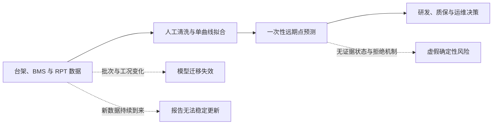
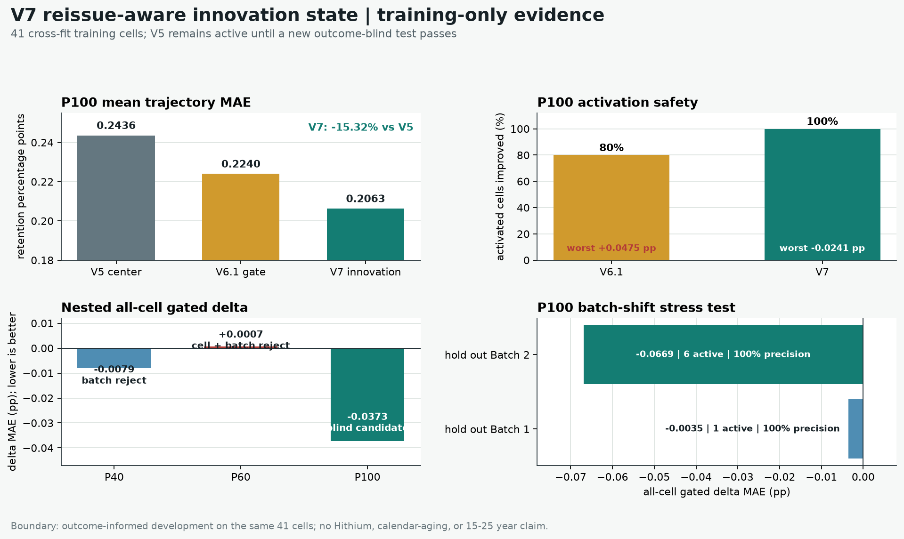
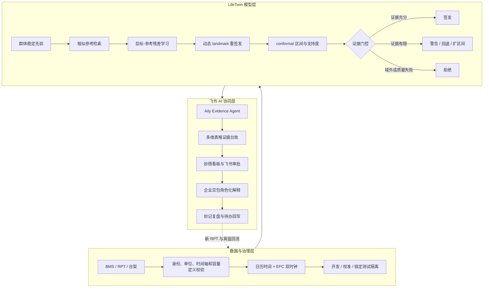

# LifeTwin 参赛方案平台粘贴版

> 本文已按主办方模板重排，并删除评分维度说明。公开数据结果与企业试点目标分开表述，避免把回顾性开发结果写成海辰产品验证结果。LifeTwin 队名及成员分工已经确认，提交前仅需检查体验链接。

## 一、参赛方案信息卡

| 项目 | 填写内容 |
|---|---|
| 队名 | **LifeTwin** |
| 命题 | **海辰储能：基于短期数据的储能电池 SOH 长期预测与动态修正** |
| 一句话摘要 | **LifeTwin 从历史电芯群体学习可迁移的退化参照，用目标电芯持续到来的短期 RPT/BMS 数据滚动修正 SOH 轨迹，并根据证据强弱自动选择签发、扩大区间、回退或拒绝，再通过飞书 AI 形成可审计的研发、质保与运维闭环。** |
| 成员介绍与分工 | **刘锦城（Jincheng Liu）**：项目负责人及算法工程负责人，负责命题分析、公开数据治理、算法与实验设计、模型实现、未来标签隔离审计及企业私有数据接入协议。**张益诚**：产品与方案协同负责人，负责业务场景梳理、飞书 AI 工作流设计、交互演示、材料组织与答辩协同。两位成员共同负责方案验证、风险边界复核与项目交付。 |
| 使用的飞书 AI 能力 | **飞书 Aily、飞书多维表格、妙搭、企业豆包、飞书审批与妙记。** Aily 负责任务编排和证据判定；多维表格记录电芯、模型、预测、审批与评分台账；妙搭提供研发/质保/运维看板；企业豆包只解释模型返回的结构化结果；审批和妙记用于人工复核、评审沉淀与责任追踪。当前已完成接口契约和工作流蓝图，海辰租户内的正式部署需在获得授权后实施。

## 二、方案成果展示

### 1. 命题场景、问题与痛点

储能电站设计寿命通常达到 15 至 25 年，但磷酸铁锂储能电芯的大规模运行数据只积累了有限年限。研发团队需要提前判断材料体系与设计裕量，质保团队需要评估长期风险，运维团队又会不断获得新的 BMS、RPT 和工况数据。传统方法往往把早期容量点拟合成一条经验曲线后直接远期外推，难以同时处理批次差异、温度/SOC/倍率变化、晚期拐点以及新数据持续到来的问题。

核心痛点可拆为五项：

1. **数据时长与决策周期不匹配**：数年历史数据需要支撑十余年的产品与资产决策，远期轨迹在统计上可能不可辨识。
2. **不同电芯与工况退化路径不一致**：单一经验曲线难以覆盖批次、温度、SOC、DOD、倍率和运行策略差异。
3. **新数据无法形成闭环**：每次 RPT 或可靠 SOH 检查到来后，人工重做分析耗时且版本难追踪。
4. **模型容易在证据不足时过度自信**：传统系统只给点值，不能说明目标是否落在训练支持域内，也缺少回退与拒绝机制。
5. **算法与企业协作脱节**：数据、模型、报告、审批和后续真值分散在不同系统，难以追溯“谁在何时用哪个版本作出了什么判断”。

### 2. 方案优势与创新点

#### 2.1 核心创新

1. **参考电芯条件化残差迁移**：先从历史电芯群体学习稳定退化参照，再将目标电芯与多个相似参考电芯组成配对样本，学习“早期状态差异如何映射为未来退化差异”。相比直接复制最近邻曲线，它既保留真实历史轨迹形状，又允许目标电芯偏离参考。
2. **日历时间与循环吞吐量双时钟数字孪生**：同时使用 elapsed days 和 EFC 描述储能电芯的日历老化与循环老化，新 RPT 到来后只更新目标电芯状态，不改写已经冻结的群体先验。
3. **证据门控的安全预测**：中心模型、支持域检测和不确定性区间分开评估。系统不是“无论如何都给答案”，而是依据输入质量、参考一致性和区间宽度自动选择正常签发、带警告签发、回退稳定模型或拒绝签发。
4. **重发感知、可失败的选择性动态更新**：复杂在线修正必须通过改善率、激活覆盖率、尾部风险、批次迁移和输入稳健性门槛。V7 会先扣除当前 V5 重发轨迹已经吸收的变化，只修正仍未解释且方向稳定的“创新量”。P100 训练内嵌套审计曾触发 9/41 个电芯并实现 9/9 改善，两个 MATR 批次双向留出也均通过；但冻结后的噪声审计发现 `0.02 pp` 扰动下误触发率达到 14.55%，因此项目主动撤回 V7 盲测候选，继续使用 V5。这说明 LifeTwin 的升级由完整证据链驱动，而不是由最好看的平均分驱动。
5. **飞书 Evidence Agent 工作流**：Aily 不自行生成 SOH 数值，而是调用校验、预测、登记和评分工具；多维表格保存输入、模型、结果与审批哈希；企业豆包只能解释模型返回的 JSON，不能把拒绝改写成可用预测。

“预测阶段不读取未来结果”是可信实验和企业盲测的底线，不单独包装为算法创新。LifeTwin 的创新在于把这条底线固化为可执行的软件与工作流契约，并在其上实现条件化残差迁移、证据门控、动态更新和失败回退。

#### 2.2 Before / After

| Before | After |
|---|---|
| 一条经验曲线覆盖所有电芯和工况 | 群体先验、相似参考和目标电芯短期状态共同决定轨迹 |
| 只输出一个远期点值 | 同时输出轨迹、区间、支持度、路由、拒绝原因和版本哈希 |
| 新数据到来后人工重做报告 | 新 RPT 触发增量重签发，保留每个 landmark 的历史版本 |
| 域外样本仍给出高置信结果 | 支持不足时自动扩区间、回退或拒绝 |
| 模型越复杂越容易被包装成升级 | 候选模型必须过冻结门槛，失败结果保留为负对照 |
| 数据、模型、审批和报告分散 | 飞书多维表格形成任务、证据、审批与真值回流台账 |

#### 2.3 已取得的可核验结果

在 MATR FastCharge 公开 LFP 数据上，模型选择只使用 41 个训练电芯，并按物理电芯进行交叉验证；81 个公开评估电芯仅用于冻结方案后的回顾性评分。预测任务使用 P20、P40、P60、P100 四个早期前缀预测至 cycle 300。

| 指标 | V2 稳定硬门控 | LifeTwin V5 | 变化 |
|---|---:|---:|---:|
| 81 个评估电芯、四前缀轨迹 MAE | 0.2865 pp | **0.2082 pp** | **降低 27.3%** |
| cell-prefix P90 MAE | 0.6325 pp | **0.4798 pp** | 降低 24.1% |
| 90% 区间经验覆盖率 | 95.04% | **93.10%** | 更接近名义覆盖率 |
| 90% 区间平均宽度 | 2.8531 pp | **1.4155 pp** | **缩窄 50.4%** |
| 单区间 WIS | 0.2208 | **0.1284** | **降低 41.8%** |

V5 相对 V2 的物理电芯配对 bootstrap 改善区间为 **[-0.1503, -0.0175] pp**。动态重签发实验中，使用更长前缀后 transition-equal MAE 从 0.2644 pp 降至 **0.1738 pp**，但仅 64.2% 的 cell-transition 改善，未达到 70% 激活门槛；三个 GP 候选和训练内选出的轻量 offset 均未晋升。

最新 V7 训练内 challenger 进一步处理“重复修正”：历史残差趋势中，先扣除新 V5 轨迹已经吸收的部分，再对未吸收创新量做有界更新。在严格外层留一电芯审计中，P100 激活 9/41 个电芯并实现 9/9 改善，全体 P100 MAE 从 0.24360 pp 降至 0.20628 pp，相对下降约 15.32%；两个训练批次双向留出也均通过。P40/P60 因批次迁移或外层指标失败而淘汰。

项目没有止步于训练内 `9/9`。冻结 V7 后又预注册前缀测量扰动审计：`sigma=0.02 pp` 时门控决策一致率仅 84.20%，原未激活电芯误触发率 14.55%；`sigma=0.05 pp` 时激活精度降至 58.58%，重复内最差 active delta 的 P95 为 `+0.1414 pp`。三项资格场景失败，V7 候选因此被撤回且从未启用，V5 继续作为 champion。这个负结果直接转化为企业落地要求：动态修正前必须有重复 RPT 或设备噪声台账，不能只相信一条看似平滑的容量趋势。

以上是结果已暴露的公开循环老化开发证据，用于证明方法和软件闭环具有可行性。它不是独立长期日历老化验证，不代表海辰产品精度，也不能外推为 15 至 25 年准确率承诺。

### 3. 具体方案说明

#### 3.1 总体架构

#### 3.2 核心功能模块

**模块一：Data Intake Agent**

- 校验 cell_id、batch_id、化学体系、额定容量、时间单位、SOC/DOD、温度和倍率字段。
- 同一物理电芯及同一批次不会跨开发、校准和锁定测试分区泄漏。
- 原始企业数据保留在企业私有环境，飞书只记录任务元数据、摘要、权限状态和哈希。

**模块二：LifeTwin 预测引擎**

- 稳定先验提供证据不足时的保底预测。
- 参考检索器从训练库寻找支持度最高的历史电芯。
- 成对残差模型预测目标与参考之间的未来退化差异，并聚合多个参考结果。
- 日历时间与 EFC 双时钟适配储能日历老化和循环老化共存的业务场景。

**模块三：不确定性与证据门控**

- conformal 区间给出可审计的不确定性范围。
- 支持域门控检查目标是否偏离训练工况与特征范围。
- 路由状态统一为 `predict`、`predict_with_warning` 和 `refuse`，并返回机器可读原因。
- 候选模型必须同时通过平均误差、尾部误差、覆盖率、最差工况和拒绝率门槛，才可替换当前模型。

**模块四：飞书 AI 工作流**

1. 研发或运维人员在 Aily 创建预测任务，提交电芯与 RPT 元数据。
2. Aily 调用输入校验工具；失败则建立补数任务，不继续预测。
3. 校验通过后调用 LifeTwin 服务，返回轨迹、区间、支持度、路由、模型版本和 SHA-256。
4. 多维表格写入不可覆盖的预测证据记录，妙搭按角色展示研发、质保和运维视图。
5. 高风险、警告或人工覆盖进入飞书审批；企业豆包只根据结构化结果生成解释。
6. 新真值到来后，评分进程先验证原预测哈希，再打开真值并计算误差；妙记沉淀评审结论和责任人。

#### 3.3 AI 应用深度与鲁棒性

- AI 深入预测任务创建、数据校验、工具编排、证据判定、审批、报告和真值回流，而不是停留在问答或文案生成层。
- Aily 工具调用失败、超时、输入域外、哈希不一致或权限不足时均停止流程并留痕。
- 企业豆包 Prompt 明确禁止自行计算、补齐或猜测 SOH；当模型返回拒绝时，首句必须写明“本次任务拒绝签发”。
- 每次人工覆盖都必须记录审批人、理由、时间以及覆盖前结果，避免 AI 或人工绕过模型治理规则。

### 4. 方案价值

#### 4.1 已验证的技术价值

- 在公开 LFP 循环老化开发队列中，V5 相对 V2 的轨迹 MAE 降低 27.3%。
- 90% 区间平均宽度缩窄 50.4%，同时保持 93.10% 的经验覆盖率。
- 动态更新、模型回退和失败实验均形成机器可读证据，避免只展示最优结果。

#### 4.2 企业试点的业务目标

以下为进入海辰私有数据试点后的目标值，不是当前已经实现的海辰收益：

| 业务环节 | 当前常见方式 | 试点目标 | 验证方法 |
|---|---|---|---|
| 单次 SOH 分析与报告 | 人工取数、清洗、绘图和解释，约 2-4 小时 | 自动流程控制在 15-30 分钟，人工只复核异常 | 统计同类任务端到端用时 |
| 新 RPT 到来后的更新 | 周期性人工重跑 | 数据就绪后 10 分钟内完成重签发与留痕 | 多维表格时间戳与任务日志 |
| 模型版本与证据追溯 | 跨系统查找，可能需要半天以上 | 通过任务 ID 或哈希在 5 分钟内定位完整链路 | 随机抽取任务做审计演练 |
| 域外和低质量数据 | 仍可能形成点预测 | 100% 进入警告、回退或拒绝路由 | 故障注入与域外样本测试 |
| 候选模型上线 | 依赖人工汇报和单一均值指标 | 平均、尾部、覆盖率和最差工况全部过门槛才晋升 | 锁定测试一次性评分 |

业务上可支持四类决策：研发阶段的设计方案比较与加速试验规划；质保阶段的风险分层与准备金评估；运维阶段的异常电芯识别和检修优先级；调度阶段的运行策略情景比较。由于尚未接入海辰数据，项目不填写虚构的成本节省、收入提升或产品精度，最终 ROI 应在企业试点中依据真实任务量和决策损失共同测算。

### 5. 方案体验入口与 Demo 视频

#### 5.1 体验入口

- GitHub 项目：<https://github.com/packl686-arch/LifeTwin-LFP-SOH>
- V5 评审控制台：<https://packl686-arch.github.io/LifeTwin-LFP-SOH/v5-console/>
- 当前 V5 发布草稿 PR：<https://github.com/packl686-arch/LifeTwin-LFP-SOH/pull/1>
- V6/V6.1 模型改进报告：`reports/fastcharge_v6_bounded_state_development_2026-08-10.md`
- V6 机器可读训练证据：`showcase/evidence_v6/`
- V7 重发感知创新状态报告：`reports/fastcharge_v7_reissue_innovation_development_2026-08-10.md`
- V7 嵌套与批次压力证据：`showcase/evidence_v7/`
- V7 前缀稳健性否决报告：`reports/fastcharge_v7_prefix_robustness_audit_2026-08-10.md`
- V7 稳健性负结果证据：`showcase/evidence_v7_robustness/`
- 本地零安装入口：`docs/v5-console/index.html`
- 测试账号：静态公开控制台无需账号；海辰租户版需企业授权后提供。

提交前应先确认 PR 已合并、GitHub Pages 已成功部署，再把 V5 控制台标记为正式体验入口。

#### 5.2 3-5 分钟 Demo 脚本

1. **0:00-0:30｜业务矛盾**：用“数年数据面对 15-25 年决策”说明为什么单曲线外推不够。
2. **0:30-1:20｜模型核心**：在 V5 控制台切换 P20/P40/P60/P100，展示相似参考、预测中心、区间和证据状态如何变化。
3. **1:20-2:00｜可量化结果**：展示 0.2082 pp、相对 V2 降低 27.3%、93.10% 覆盖率和区间缩窄 50.4%。
4. **2:00-2:40｜失败回退**：展示 GP 未达到 70% 改善门槛后自动关闭，强调系统不会因为模型更复杂就上线。
5. **2:40-3:40｜飞书 AI 闭环**：演示 Aily 创建任务、多维表格留痕、妙搭看板、审批以及企业豆包解释约束。
6. **3:40-4:20｜企业盲测**：解释“预测先封存、真值后打开、哈希校验后一次性评分”的海辰私有数据接入方式。
7. **4:20-4:40｜边界与下一步**：明确公开结果不是海辰验证，下一步是使用未参与开发的新批次完成校准与锁定测试。

## 三、自由展示区

### 1. 可落地性与推广性

- **海辰内部落地**：模型服务可部署在企业私有网络，原始数据不出域；飞书只接收白名单字段、摘要和哈希。
- **产品线推广**：通过数据字典和 adapter 替换电芯规格与字段映射，模型治理、证据门控和审批流程保持不变。
- **行业推广**：同样的“稳定先验 + 动态更新 + 不确定性 + 拒绝 + 审计”框架可迁移到光伏组件、风机、工业设备和其他长寿命资产。
- **技术扩展**：后续可加入机理约束、主动试验设计和跨批次层次模型，但任何新分支都必须经过锁定协议与晋升门槛。

### 2. 建议附加材料

- 10 页答辩 PPT 与 V5 评审控制台。
- V5 完整技术报告、机器可读评分和 bootstrap 证据。
- 动态 landmark 预注册协议、失败门槛及决策文件。
- 海辰私有盲测执行手册、数据字典和飞书工作流配置。
- 公开发布校验结果、测试记录和失败实验清单。

### 3. 未来迭代路线

1. **P0 数据对接**：仅做 schema、单位、身份和权限校验，不查看锁定测试结果。
2. **P1 批次校准**：使用开发与校准分区估计本地偏差和区间，不触碰锁定测试。
3. **P2 一次性盲测**：先封存预测和哈希，再由独立评分进程打开未来真值。
4. **P3 飞书影子运行**：Aily、多维表格、妙搭和审批以影子模式运行，验证超时、拒绝和权限故障。
5. **P4 有条件上线**：仅当平均、尾部、覆盖率、最差工况和运营可靠性全部过门槛时晋升。

## 四、附录

### 1. 幕后故事

项目没有沿着“模型越复杂越好”的方向包装结果。CALCE PLN 经审计发现并非适合该命题的长期 LFP 验证数据；SNL 原始逐循环吞吐记录也不能直接当作完整 SOH，因此协议在预测前终止并改为 RPT 轨迹分析。V5 中三个 GP 在线修正候选均未通过门槛，系统保留稳定中心而不是选择最好看的局部结果。最终形成的核心原则是：**模型只能凭新证据晋级，不能凭叙事晋级。**

### 2. 参考项目与文献

1. Severson et al., *Data-driven prediction of battery cycle life before capacity degradation*, Nature Energy, 2019.
2. Attia et al., *Closed-loop optimization of fast-charging protocols for batteries with machine learning*, Nature, 2020.
3. Richardson et al., Gaussian-process methods for lithium-ion battery health forecasting.
4. Naumann et al., LFP calendar-aging datasets and modelling studies.
5. Lam et al., *A decade of insights: Delving into calendar aging trends and implications*, Joule, 2025.
6. BatLiNet, generalized battery life prediction through transfer learning.
7. BatteryML, reproducible battery degradation modelling and benchmarking framework.

### 3. 提交前最后检查

- 队名 LifeTwin 及刘锦城、张益诚两位成员分工已经确认。
- 删除本文开头的编辑提示和本检查清单。
- 等待 PR、GitHub Pages 和体验入口全部可访问。
- 录制 3-5 分钟 Demo，并检查公开权限、二维码和链接有效期。
- 不把公开 FastCharge 开发结果写成海辰产品验证或 15-25 年准确率。
- 将“企业试点目标”与“已经验证的公开数据结果”保持视觉和文字上的明确分隔。
