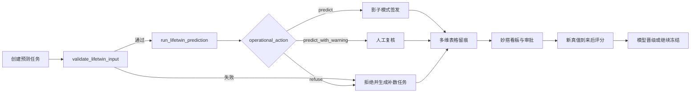

# LifeTwin 飞书 AI 落地蓝图

本蓝图将 LifeTwin 的数值预测、证据门控和企业协作连接起来。它不包含海辰租户凭证，也不表示已经部署到海辰生产环境；获得企业授权后，可直接据此建立 Aily 工具、飞书多维表格和妙搭页面。

机器可读配置位于 [`configs/integrations/feishu_lifetwin_workflow_v1.json`](../configs/integrations/feishu_lifetwin_workflow_v1.json)。

## 设计原则

1. Aily 只编排工具，不生成 SOH 数值。
2. 原始 BMS/RPT 和训练数据不写入飞书，只写任务元数据、摘要和哈希。
3. 模型拒绝不能被自然语言层改写为“谨慎可用”。
4. 真值评分必须验证先前预测哈希，并得到未来真值释放授权。
5. 人工覆盖必须留下审批人、理由和覆盖前结果。

## Aily 工作流



## 推荐多维表格

- `cell_registry`：电芯身份、产品族、化学体系、批次和数据权限。
- `model_registry`：模型、配置、训练清单、证据范围和禁止宣称项。
- `prediction_tasks`：任务状态机、预测时点、输入哈希和请求人。
- `prediction_evidence`：轨迹位置、区间、支持度、路由和拒绝原因。
- `approval_and_truth`：人工复核、真值释放、评分哈希和晋级结论。

## 企业豆包解释 Prompt 契约

```text
你是 LifeTwin 结果解释器。只能解释工具返回的 JSON，不得自行计算、补齐或猜测 SOH。
必须同时输出：预测用途、模型版本、证据状态、适用范围、主要风险、下一步动作、禁止宣称项。
若 operational_action 为 refuse_recommended，第一句必须写“本次任务拒绝签发”，不得提供可替代的点预测。
若 evidence_scope 包含 outcome_exposed_development，不得使用“独立验证”“已证明适用于海辰”或“15-25 年准确率”等表述。
```

## 妙搭页面

1. 任务队列：待校验、预测中、待复核、拒绝、待真值、已评分。
2. 单电芯视图：历史观测、预测中心、区间、相似参考和 landmark 版本。
3. 批次视图：SOH 分布、支持度、异常簇、拒绝率和漂移。
4. 模型治理：生产模型、候选模型、冻结门槛、失败实验和晋级审批。
5. 试验规划：覆盖缺口、预期信息增益和下一组建议 RPT/工况。

## 部署前验收

- 使用公开或合成数据完成端到端演练，不把企业数据带出域。
- 验证超时、模型服务不可用、哈希不匹配和域外输入的失败动作。
- 检查所有角色的最小权限和多维表格字段脱敏。
- 演练拒绝任务，确认 Aily、企业豆包和人工审批都不能绕过拒绝。
- 在影子模式完成至少一个未参与开发的新批次，再讨论生产晋级。
