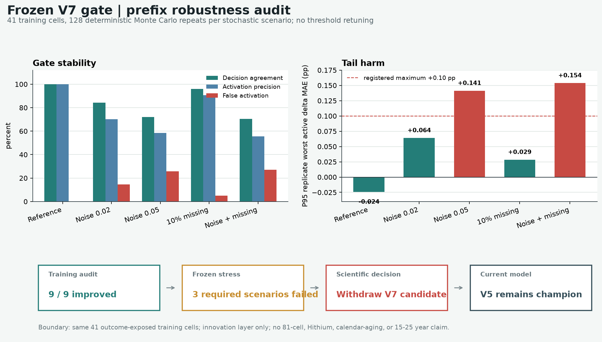

# FastCharge V7 冻结门控前缀稳健性审计

## 结论先行

冻结的 V7-P100 候选在无扰动的 41 个训练电芯上仍复现 `9/9` 激活改善，但它没有通过预注册的前缀测量稳健性门槛。加入仅 `0.02 pp` 标准差的独立高斯扰动后，门控决策一致率降至 `84.20%`，原 9 个激活的保留率为 `79.77%`，原未激活电芯的误激活率达到 `14.55%`。`0.05 pp` 扰动下，激活精度进一步降至 `58.58%`，每次重复中最差激活退化的第 95 百分位达到 `+0.1414 pp`。

因此，本轮决策是：**撤回当前形式的 V7-P100 新电芯盲测候选，V5 继续作为 champion。** 后续若继续研究创新状态更新，必须先注册独立的测量质量门控或重复 RPT 方案，不能在同一批 41 个电芯上调整 V7 阈值后重新包装为成功。

这是一项同一训练队列上的冻结规则稳健性诊断，不是独立准确率验证。审计没有读取或复用 81 个已暴露公开评估电芯，也不支持海辰产品、日历老化或 15 至 25 年精度声明。

## 1. 为什么在盲测前增加这一关

V7 的激活依赖很小的残差斜率与符号判断。冻结规则中的最小投影创新量为 `0.01 pp`，对应 40-cycle 窗口上的斜率量级只有 `0.00025 pp/cycle`。训练内的漂亮均值可能来自少量大收益电芯，却不能说明激活边界对测量扰动稳定。

本实验不再搜索模型、尺度或阈值，而是提出一个更直接的可证伪问题：

> 如果容量历史发生轻微噪声或缺测，冻结的 V7 是否仍会对基本相同的电芯作出基本相同的激活决定，并继续控制误激活的尾部风险？

若答案是否定的，就不应消耗新的完整寿命电芯去确认一个尚未具备输入稳健性的候选。

## 2. 冻结协议

| 项目 | 冻结设置 |
|---|---|
| 冻结候选 | `v7_p100_reissue_innovation_blind_candidate`，不允许修改 |
| 数据 | 41 个 MATR 训练电芯的 V5 cross-fit 签发轨迹 |
| 禁止数据 | 81 个已暴露公开评估电芯、海辰数据、任何新结果 |
| 扰动位置 | 仅 P60 签发在 cycles 61..100 的已观测残差历史 |
| 保持不变 | P60/P100 V5 中心轨迹、V7 尺度、阈值、修正上限和未来坐标 |
| 随机性 | 每场景 128 次；按场景、重复和物理电芯派生稳定 SHA-256 seed |
| 评分单位 | 物理电芯等权；未来真值只进入门控完成后的后果评分 |
| 作用范围 | V7 innovation layer；不是完整 V5 端到端传感器扰动测试 |

资格场景在运行前写入各自门槛。完整协议见
[`v7_frozen_gate_prefix_robustness_audit.json`](../configs/experiments/v7_frozen_gate_prefix_robustness_audit.json)。

## 3. 主要结果

| 场景 | 角色 | 决策一致率 | 原激活保留率 | 原未激活误触发率 | 激活精度 | 全体 mean delta (pp) | 重复内最差 active delta 的 P95 (pp) | 结论 |
|---|---|---:|---:|---:|---:|---:|---:|---|
| 无扰动复现 | 完整性 | 100.00% | 100.00% | 0.00% | 100.00% | -0.03732 | -0.02410 | 通过 |
| 常数偏移 +0.20 pp | 完整性 | 100.00% | 100.00% | 0.00% | 100.00% | -0.03732 | -0.02410 | 通过 |
| IID 噪声 sigma=0.02 pp | 资格 | 84.20% | 79.77% | 14.55% | 70.30% | -0.03203 | +0.06411 | **失败** |
| IID 噪声 sigma=0.05 pp | 资格 | 71.95% | 63.54% | 25.68% | 58.58% | -0.02665 | +0.14140 | **失败** |
| 随机缺失 10% | 资格 | 95.87% | 98.78% | 4.96% | 90.60% | -0.03746 | +0.02855 | 通过 |
| sigma=0.05 pp + 缺失 10% | 资格 | 70.45% | 62.07% | 27.20% | 55.49% | -0.02592 | +0.15395 | **失败** |
| 单点尖峰 0.20 pp | 诊断 | 96.40% | 98.26% | 4.13% | 92.24% | -0.03713 | +0.02840 | 记录，不参与晋级 |
| 线性漂移跨度 0.10 pp | 诊断 | 23.93% | 76.65% | 90.89% | 31.65% | +0.00802 | +0.19034 | 严重依赖独立漂移质检 |
| 最近 5 点缺失 | 诊断 | 90.24% | 88.89% | 9.38% | 90.91% | -0.03704 | +0.00658 | 记录，不参与晋级 |



结果逐字节重复运行两次，`baseline_cell_scores.csv`、`perturbation_decisions.csv`、`scenario_summary.csv`、`decision.json` 和 `manifest.json` 的 SHA-256 均一致。

## 4. 结果如何理解

### 4.1 均值改善掩盖了错误激活

`sigma=0.05 pp` 时，全体 mean delta 仍为 `-0.02665 pp`，表面上似乎仍有收益；但激活精度只有 `58.58%`，全局最差激活退化达到 `+0.22593 pp`。少数大收益电芯拉低了均值，不能抵消大量不稳定激活。对于需要长期签发和保修决策的系统，尾部风险比一个漂亮均值更重要。

### 4.2 缺测不是当前最主要的问题

随机删除 10% 历史点仍通过资格门槛，单点尖峰也相对稳定。这符合 Theil-Sen 斜率的稳健性质。真正的问题是：大量未激活电芯距离斜率和符号边界很近，连续的小幅噪声足以改变门控状态。

### 4.3 线性漂移无法由当前状态量区分

跨度 `0.10 pp` 的线性漂移使原未激活电芯误触发率达到 `90.89%`。这不是通过再调一个阈值就能可靠解决的问题：仅观察残差斜率时，模型无法知道斜率来自真实退化、容量估计偏移还是测试系统漂移。部署前必须引入重复测量、参考通道或设备校准证据。

### 4.4 噪声幅度不是设备性能声明

`0.02 pp` 与 `0.05 pp` 是本轮注册的敏感性水平，并未由海辰测试设备的重复性试验标定。结果说明“如果有效测量噪声达到该量级，V7 不合格”，不能反向宣称真实设备一定处于这一噪声范围。

## 5. 科学决策

1. 当前 V7-P100 候选从“等待新电芯盲测”调整为“稳健性不合格，暂不进入盲测”。历史冻结文件保持不变，作为可追溯的原始提名记录；本报告与机器可读 decision 形成后续否决记录。
2. V5 保持 champion。V7 从未被激活，因此本次否决不改变任何已签发轨迹。
3. 不允许在相同 41 个结果已知电芯上提高投影阈值、改变斜率窗口或筛掉不利电芯后再次宣称通过。
4. 下一轮优先解决“输入是否足以支持修正”，而不是继续扩大修正幅度或增加黑盒模型。

## 6. 下一轮实验：测量稳定性门控的独立预注册

下一候选不直接称为更高版本模型，而先注册为 `measurement-stability gate`：

1. **先测噪声，再看寿命结果。** 在新物理批次上对关键 RPT 做重复测量，冻结每台设备、温度区间和容量计算链路的 `sigma_measurement`；未来后缀保持隐藏。
2. **签发时做概率化门控。** 以冻结的测量误差分布对前缀重采样，只有基础 V7 门控本身通过、重采样激活概率不低于 95%、修正方向稳定率不低于 95%，才允许非零修正。
3. **不稳定即回退。** 任一质量证据缺失、设备漂移检查失败或稳定激活数不足 6 个时，整批保留 V5，不将“没有足够激活”解释成模型成功。
4. **一次性盲测。** 至少 40 个新物理电芯；若稳定门控预计显著降低覆盖，应在看结果前扩大样本量。预测、质量状态、激活标志和哈希先提交，再统一打开 cycles 101..300。
5. **同时考核业务代价。** 除 MAE 外，报告误激活率、拒绝率、重复测试时间、每获得一个合格激活需要的电芯数，以及最差 active delta。

若没有重复测量或设备噪声台账，下一轮不应继续 V7 路线；应把资源投向 V5 的跨批次独立确认和储能日历数据接入。

上述阶段 A/B/C、停止规则和业务指标已整理为
[`v8_measurement_stability_blind_protocol.template.json`](../configs/experiments/v8_measurement_stability_blind_protocol.template.json)。它当前是因缺少独立测量重复性数据和新物理电芯而阻塞的实验模板，不是新的模型结果或已冻结候选。

## 7. 可复核资产

- 实现：`src/lifetwin/experiments/fastcharge_v7_prefix_robustness.py`
- runner：`scripts/run_fastcharge_v7_prefix_robustness_audit.py`
- 协议：`configs/experiments/v7_frozen_gate_prefix_robustness_audit.json`
- 测试：`tests/test_fastcharge_v7_prefix_robustness.py`
- 公开聚合证据：`showcase/evidence_v7_robustness/`

复现命令：

```powershell
$env:PYTHONPATH = "src"
python scripts\run_fastcharge_v7_prefix_robustness_audit.py
python -m pytest -q tests\test_fastcharge_v7_prefix_robustness.py
```
